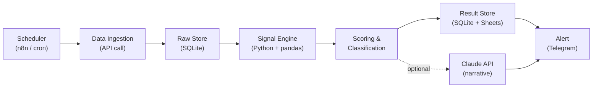

# Markup Radar — IDX Swing Signal Confirmation Engine

> **Working name:** Markup Radar (silakan rename)
> **Tujuan:** Mengonfirmasi apakah sebuah saham IDX **masih dalam fase akumulasi** atau **mulai transisi ke markup**, menggunakan data bid/offer harian (done detail) + broker flow, untuk menentukan aksi entry esok hari.
> **Metodologi:** Wyckoff Smart Money + Bandarmologi (pendekatan swing)
> **Status:** Spec untuk implementasi via Claude Code
> **Versi:** 0.1

---

## 1. Tujuan & Konteks

### Problem Statement
Dalam swing trading berbasis Wyckoff + Bandarmologi, sinyal akumulasi (broker besar net buy selama beberapa hari) relatif mudah dideteksi. Yang **sulit adalah timing**:

- Kita tidak pernah tahu **kapan bandar selesai mengumpulkan barang**.
- Kita tidak tahu **kapan bandar mulai markup (mark up harga)**.

Entry terlalu cepat = nyangkut di fase akumulasi yang berkepanjangan. Entry terlambat = ketinggalan markup.

### Solusi
Engine ini **mengonfirmasi sinyal akumulasi** yang sudah dikumpulkan, dengan membaca **data bid/offer (done) harian** untuk menjawab satu pertanyaan operasional:

> "Esok hari, apakah barang masih dikumpulkan (akumulasi berlanjut) atau buyer sudah ambil alih kendali (markup mulai)?"

### Karakteristik Penting
- **Siklus harian (EOD)**, bukan intraday real-time. Engine berjalan setelah market tutup, menghasilkan watchlist untuk besok.
- **Signal-only**, bukan auto-execute. Output berupa klasifikasi + alert; keputusan eksekusi tetap di tangan trader (lihat §9).
- Tidak memerlukan feed order book live yang mahal/berlisensi (lihat §7).

---

## 2. Konsep Inti: "Done by Bid vs Done by Offer"

Sinyal kunci engine ini adalah **klasifikasi transaksi done harian**, bukan antrian order book live.

| Kondisi | Arti | Implikasi Wyckoff |
|---|---|---|
| **Done di OFFER** dominan | Pembeli agresif mengangkat harga offer → demand kuat | Buyer in control; bila + volume → **markup mulai** |
| **Done di BID** dominan, **harga turun** | Penjual agresif lego di bid → supply menang | Distribusi / weakness |
| **Done di BID** dominan, **harga DITAHAN** | Bandar menyerap semua jualan tanpa turunkan harga → **absorpsi** | **Akumulasi masih berlangsung** (barang belum cukup) |

**Insight inti:** Nuansa "done-at-bid tapi harga tidak turun = absorpsi" inilah jawaban langsung untuk pertanyaan "masih dikumpulin barangnya". Ini yang membedakan akumulasi sehat dari distribusi.

---

## 3. Sinyal & Interpretasi

Semua sinyal dihitung dari data **EOD (end-of-day)**:

| # | Sinyal | Definisi | Pembacaan |
|---|---|---|---|
| S1 | **Done Ratio** | `done_offer_value / (done_offer_value + done_bid_value)` | `>0.55` buyer control; `<0.45` seller control; `0.45–0.55` netral |
| S2 | **Absorption Flag** | `done_ratio < 0.45` **AND** `price_change >= 0` **AND** `volume tinggi` | True → akumulasi berlanjut (absorpsi) |
| S3 | **Broker Net Flow** | Net buy/sell top-N broker (value & lot) | Broker besar sama net buy beruntun = akumulasi |
| S4 | **Broker Concentration** | Konsentrasi net buy di top-5 broker | Tinggi + konsisten = aktivitas terkoordinasi (bandar) |
| S5 | **Closing Queue Imbalance** | `bid_volume / offer_volume` di close | `>1` demand menumpuk |
| S6 | **Volume Spike (RVOL)** | `volume / MA20(volume)` | `>=2.0` = spike |
| S7 | **Close Position in Range** | `(close - low) / (high - low)` | `>0.6` close kuat (effort→result positif) |
| S8 | **Foreign Flow** | Foreign net buy/sell harian | Konfirmasi tambahan arah smart money |
| S9 | **IHSG Filter** | `IHSG vs MA50` | `IHSG > MA50` = market suportif untuk markup |

> **Catatan ketersediaan data:** S1, S2 bergantung pada **done detail** yang merupakan field spesialis (lihat §7 — gating question). S3–S9 tersedia dari broker summary + OHLCV standar.

---

## 4. Logika Scoring & Klasifikasi

Output engine adalah salah satu dari lima state per saham:

| State | Makna | Aksi |
|---|---|---|
| `MARKUP_START` | Transisi ke markup terkonfirmasi | **Watchlist entry prioritas** |
| `ACCUMULATION_ONGOING` | Masih akumulasi (absorpsi aktif) | Pantau, belum entry |
| `DISTRIBUTION_WARNING` | Indikasi distribusi | Hindari / siapkan exit |
| `NEUTRAL` | Tidak ada sinyal jelas | Abaikan |
| `INSUFFICIENT_DATA` | Data kurang (mis. done detail tidak ada) | Fallback ke S3–S9 saja |

### Rule-based classification (pseudocode)

```python
def classify(signals: dict) -> str:
    s = signals  # S1..S9 sudah dihitung

    ihsg_ok = s["ihsg_above_ma50"]

    # MARKUP_START: buyer ambil alih + konfirmasi volume + close kuat + broker masih akumulasi
    if (s["done_ratio"] > 0.60
            and s["rvol"] >= 2.0
            and s["close_in_range"] > 0.6
            and s["broker_net_buy_streak"] >= 1
            and ihsg_ok):
        return "MARKUP_START"

    # ACCUMULATION_ONGOING: absorpsi (done-at-bid tapi harga ditahan) ATAU broker net buy diam-diam
    if (s["absorption_flag"]
            or (s["broker_net_buy_streak"] >= 3
                and s["price_ranging"]
                and 0.45 <= s["done_ratio"] <= 0.55)):
        return "ACCUMULATION_ONGOING"

    # DISTRIBUTION_WARNING: seller menang + broker besar berbalik jual + harga di puncak range
    if (s["done_ratio"] < 0.40
            and s["broker_turning_net_sell"]
            and s["near_range_high"]):
        return "DISTRIBUTION_WARNING"

    return "NEUTRAL"
```

### Confidence score (opsional, 0–100)

Beri bobot tiap sinyal yang searah dengan state, normalisasi ke 0–100. Contoh bobot untuk `MARKUP_START`:

```
score = (
    w1 * norm(done_ratio)        # 25
  + w2 * norm(rvol)              # 20
  + w3 * norm(close_in_range)    # 15
  + w4 * norm(broker_streak)     # 20
  + w5 * norm(queue_imbalance)   # 10
  + w6 * (10 if ihsg_ok else 0)  # 10
)
```

> **Threshold di atas adalah default awal — wajib di-tune lewat backtesting (Phase 5).**

---

## 5. Wyckoff Phase Mapping

Sebagai konteks interpretasi engine:

| Fase | Karakteristik harga | Tanda di sinyal engine |
|---|---|---|
| **Phase A** (stopping action) | SC, AR, ST | Volume spike di down-bar (climax), lalu mereda |
| **Phase B** (building cause) | Ranging panjang | Broker net buy senyap, done ratio fluktuatif, absorpsi sesekali |
| **Phase C** (test / spring) | Spring/shakeout | Absorption flag True, done-at-bid tapi close pulih |
| **Phase D** (markup awal) | SOS, LPS, jump the creek | **`MARKUP_START`**: done-offer melonjak, RVOL>=2, close kuat, queue bid menumpuk |
| **Phase E** (markup) | Trend naik | Done-offer konsisten dominan, higher highs |

Target operasional engine = **mendeteksi transisi Phase C → D** (akumulasi selesai → markup mulai).

---

## 6. Arsitektur Sistem

### Alur (EOD daily pipeline)



### Komponen

1. **Scheduler** — n8n Schedule node di VPS (`srv1734192.hstgr.cloud`, KVM 2) trigger setelah market close (~16:30 WIB). Alternatif: GitHub Actions cron.
2. **Data Ingestion** — tarik per-saham (atau batch watchlist): OHLCV harian, broker summary, done detail (jika ada), foreign flow. Plus IHSG untuk S9.
3. **Raw Store** — **SQLite** (primary) untuk time-series + rolling window + backtesting. Mirror opsional ke Google Sheets untuk visibility.
4. **Signal Engine** — Python + pandas. Hitung S1–S9 (rolling MA, ratio, flags).
5. **Scoring & Classification** — rule engine §4. Output state + confidence + breakdown sinyal.
6. **Result Store** — simpan hasil harian (per saham, per tanggal) untuk histori & audit.
7. **Alert** — Telegram bot. Kirim watchlist `MARKUP_START` + `ACCUMULATION_ONGOING` + `DISTRIBUTION_WARNING`.
8. **Claude API (opsional)** — generate narasi per alert, mis: *"BBRI: done-offer 0.68, broker net buy 5 hari, RVOL 2.3x, close kuat → indikasi markup mulai. IHSG di atas MA50."*

### Tech Stack

| Layer | Pilihan | Catatan |
|---|---|---|
| Orchestration | n8n (self-hosted VPS) | Sesuai infra existing; alt: GitHub Actions |
| Compute | Python 3.12+, pandas | Rolling window & signal math |
| Data store | SQLite | + opsional Google Sheets mirror |
| Data source | OHLC.dev / Sectors.app | Lihat §7 |
| LLM (opsional) | Anthropic API (Claude) | Narasi alert |
| Notifikasi | Telegram Bot API | |

---

## 7. Sumber Data — Evaluasi & Gating Question

### Kebutuhan data terbagi 3 tier ketersediaan

**✅ Tier 1 — Mudah & murah (EOD):** OHLCV harian, broker summary (net buy/sell per broker), closing bid/offer queue, foreign flow.
- **OHLC.dev** (via RapidAPI): IDX broker summaries, OHLCV (`getOHLCV`, `getLatestOHLCV`), mulai ~$15/bln, ada free tier.
- **Sectors.app**: fitur Bandarmology (aktivitas broker & asing), native IDX/SG/MY, query natural language, update harian, coverage ~99% saham IDX.
- **Invezgo**: analisa transaksi broker + foreign flow kumulatif.
- **IDX resmi**: Trading Summary, Stock Summary (sudah memuat kolom Bid/BidVolume/Offer/OfferVolume close + ForeignBuy/Sell), Participants/Broker.

**⚠️ Tier 2 — Spesialis (HARUS DIVERIFIKASI): Done detail (done by bid/offer).**
- Ini field paling penting (S1, S2) tapi paling jarang diekspos.
- Bukan field standar Stock Summary IDX → diturunkan dari tick/done detail.
- Stockbit menampilkan ini karena menghitung sendiri.
- **Catatan keras:** bahkan platform pro (Eikon/LSEG) sulit menyediakan data bid/ask + volume per broker harian — ini memang premium.

**❌ Tier 3 — Mahal/berlisensi (live intraday):** Order book Level 2 real-time (absorpsi live). Hanya dari ICE Consolidated Feed atau langganan Market Data BEI. **Tidak dibutuhkan** untuk strategi swing siklus harian ini.

### ⭐ GATING QUESTION (keputusan kritis sebelum coding)

> **Apakah OHLC.dev mengekspos done-by-bid/offer breakdown, atau hanya net buy/sell broker?**

- **Jika YA** → OHLC.dev cukup sebagai sumber tunggal. Lanjut full build.
- **Jika TIDAK** → dua opsi:
  1. Kombinasikan OHLC.dev (OHLCV + broker) + sumber done-detail terpisah (Sectors Bandarmology / Stockbit-derived).
  2. Jalankan engine **mode degraded**: S1/S2 di-skip, andalkan S3–S9 (broker flow + volume + close). State `MARKUP_START` tetap bisa, akurasi absorpsi berkurang.

---

## 8. Data Verification Checklist (OHLC.dev Playground)

Jalankan **sebelum** mulai coding (RapidAPI host: `indonesia-stock-exchange-idx.p.rapidapi.com`):

- [ ] List semua endpoint yang tersedia (catat nama + parameter).
- [ ] Cek endpoint broker summary: apakah ada field done-at-bid / done-at-offer, atau hanya net buy/sell?
- [ ] Cek granularitas OHLCV: harian saja atau ada interval intraday (1m/5m/15m)?
- [ ] Cek apakah ada field closing bid/offer + bid_volume/offer_volume.
- [ ] Cek ketersediaan foreign buy/sell harian.
- [ ] Cek histori berapa tahun ke belakang (untuk backtesting Phase 5).
- [ ] Cek apakah data EOD real-time atau ada delay (mis. 15 menit).
- [ ] Cek rate limit per tier RapidAPI vs jumlah saham yang mau di-scan.
- [ ] Cek struktur response (JSON shape) tiap endpoint → simpan sample untuk parser.

> Simpan hasil checklist ini; jadi input keputusan di §7 (gating question).

---

## 9. Risk Management Rules

Engine ini **signal-only**. Aturan risiko trader (tetap berlaku, tidak di-bypass engine):

- **Max risk per trade: 1%** dari modal.
- **Min Risk:Reward = 1:2.**
- **Konfirmasi volume spike** wajib (sudah jadi S6).
- **Filter IHSG vs MA50** (sudah jadi S9) — tidak entry saat market bearish.
- Engine **tidak melakukan order otomatis**. Output = watchlist + klasifikasi + confidence. Eksekusi & sizing manual oleh trader.

> Prinsip: separation of concerns — engine bertugas **deteksi & konfirmasi sinyal**, bukan eksekusi atau money management.

---

## 10. Rencana Implementasi Bertahap (untuk Claude Code)

### Phase 0 — Verifikasi Data
- Jalankan checklist §8. Tentukan gating question §7. **Blocker untuk semua fase berikut.**

### Phase 1 — Ingestion & Storage
- Setup project + config (API key via env, jangan hardcode).
- Modul fetch: OHLCV, broker summary, (done detail jika ada), foreign flow, IHSG.
- Skema SQLite + writer dengan dedup tanggal.
- **DoD:** bisa tarik & simpan data 1 saham untuk rentang tanggal, idempoten.

### Phase 2 — Signal Engine
- Implement S1–S9 (pandas, rolling window).
- Unit test per sinyal dengan data sintetis (PyTest).
- **DoD:** semua sinyal terhitung benar & teruji untuk kasus akumulasi/markup/distribusi.

### Phase 3 — Scoring & Classification
- Implement rule engine §4 + confidence score.
- Config threshold di file terpisah (YAML/JSON) agar mudah di-tune.
- **DoD:** menghasilkan state + confidence + breakdown per saham per tanggal.

### Phase 4 — Alerting
- Telegram bot: format pesan watchlist (state, confidence, sinyal kunci).
- Filter: hanya kirim state actionable.
- **DoD:** alert harian terkirim ke Telegram dengan format rapi.

### Phase 5 — Backtesting & Tuning
- Replay histori: cek berapa sering `MARKUP_START` benar diikuti markup dalam N hari.
- Tune threshold §4 berdasarkan hasil.
- **DoD:** laporan akurasi per state + threshold final.

### Phase 6 — Enhancement (opsional)
- Narasi via Claude API.
- Mirror hasil ke Google Sheets + dashboard.
- Orkestrasi penuh di n8n (schedule + error handling + watchdog).

---

## 11. Struktur Project (saran scaffold)

```
markup-radar/
├── config/
│   ├── settings.yaml        # threshold, watchlist, window
│   └── .env.example         # API keys (RapidAPI, Telegram, Anthropic)
├── src/
│   ├── ingest/              # fetch + parse per sumber data
│   │   ├── ohlc_client.py
│   │   ├── broker_client.py
│   │   └── ihsg_client.py
│   ├── store/
│   │   └── db.py            # SQLite schema + writers
│   ├── signals/
│   │   ├── done_ratio.py    # S1, S2
│   │   ├── broker_flow.py   # S3, S4
│   │   ├── price_volume.py  # S5, S6, S7
│   │   └── market.py        # S8, S9
│   ├── scoring/
│   │   ├── classifier.py    # rule engine §4
│   │   └── score.py         # confidence
│   ├── alert/
│   │   └── telegram.py
│   └── narrative/           # opsional, Claude API
│       └── claude.py
├── tests/                   # PyTest
├── scripts/
│   └── run_daily.py         # entrypoint EOD
├── data/                    # SQLite db (gitignore)
├── requirements.txt
└── README.md
```

---

## 12. Open Questions / Keputusan yang Dibutuhkan

1. **Gating question §7** — hasil verifikasi done-detail OHLC.dev. (Prioritas #1.)
2. **Universe saham** — scan seluruh IDX, LQ45, atau watchlist manual? (Pengaruh ke rate limit.)
3. **Data layer** — SQLite saja, atau wajib mirror Google Sheets sejak awal?
4. **Orchestration** — n8n di VPS atau GitHub Actions untuk MVP?
5. **Sumber fallback** — kalau OHLC.dev tak punya done-detail, pilih Sectors Bandarmology atau mode degraded?
6. **Backtesting window** — berapa tahun histori yang dibutuhkan & tersedia?

---

## 13. Definition of Done (keseluruhan)

Engine dianggap selesai (MVP) bila:
- Berjalan otomatis setiap hari setelah market close.
- Menghasilkan watchlist terklasifikasi (`MARKUP_START` / `ACCUMULATION_ONGOING` / `DISTRIBUTION_WARNING`) dengan confidence.
- Alert terkirim ke Telegram.
- Logika absorpsi (atau mode degraded) berfungsi sesuai gating question.
- Threshold sudah ditune via backtesting dengan laporan akurasi.

---

*Spec ini fokus pada WHAT & logika. Detail implementasi (library version, error handling, retry) diserahkan ke Claude Code mengikuti best practice.*
